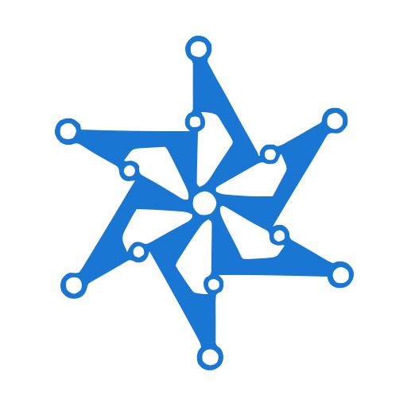

<table>
<tr>
<td width="100"></td>
<td>
<h1>openMatterSmartLock</h1>
<sub><b>Built for the Matter protocol</b> · hardware-independent Door Lock firmware · Zephyr + nRF Connect SDK + ConnectedHomeIP</sub>
</td>
</tr>
</table>

[](https://github.com/jakub-michalik/open-smart-lock/actions/workflows/build.yml)
[](https://github.com/jakub-michalik/open-smart-lock/actions/workflows/tests.yml)
[](https://jakub-michalik.github.io/open-smart-lock/)

> **An open, hardware-independent Matter Door Lock reference implementation.**
> Built on Zephyr, the nRF Connect SDK, and the ConnectedHomeIP (Matter) stack.
> Designed from day one with a clean layered architecture and explicit hardware abstraction interfaces.

## What this is

openMatterSmartLock is a complete Matter Door Lock firmware that:

- implements the standard **Matter Door Lock cluster**, so the device commissions and behaves as a first-class Matter Door Lock in any ecosystem (Apple Home, Google Home, Home Assistant, SmartThings),
- runs on the nRF52840 SoC via Zephyr's devicetree and Kconfig, with porting to other Nordic SoCs intentionally left as a small, well-defined exercise,
- **does not assume specific actuator hardware**: actuator, feedback, and power-gating are exposed as Hardware Abstraction Layer (HAL) interfaces with selectable driver implementations,
- supports **Thread, Wi-Fi, and runtime transport switching** on platforms that support it,
- ships with a **PWM servo driver** as the reference actuator implementation and clear extension points for DC motors, latching solenoids, or stepper drives.

Commissioning is performed through any standard Matter commissioner — Apple Home, Google Home, Home Assistant, SmartThings, or the public Matter sample apps. openMatterSmartLock does not ship its own companion app; the device behaves as a first-class Matter Door Lock and is fully controllable from any compliant ecosystem.

## What this is not

openMatterSmartLock is not a certified smart lock, not a finished consumer product, and not a substitute for proper mechanical and security certification. The implementation is reference quality: clean architecture, documented decisions, working build, but no compliance claims.

## Architecture at a glance

```text
┌─────────────────────────────────────────────────────────────┐
│  Matter ecosystem (Apple Home / Google Home / HA / etc.)    │
└──────────────────────────┬──────────────────────────────────┘
                           │  Matter Door Lock cluster over Thread / Wi-Fi
                           ▼
┌─────────────────────────────────────────────────────────────┐
│  Protocol integration: ZCL Door Lock cluster glue           │
├─────────────────────────────────────────────────────────────┤
│  Application orchestration (Application)                        │
│    - lifecycle, event routing, heartbeat                    │
├─────────────────────────────────────────────────────────────┤
│  Lock domain (LockController)                              │
│    - Initiated → Completed state machine                    │
│    - PIN validation, access delegation                      │
├─────────────────────────────────────────────────────────────┤
│  Access and persistence (AccessController + AccessStore)     │
│    - users, credentials, schedules                          │
├─────────────────────────────────────────────────────────────┤
│  Hardware Abstraction Layer (HAL) — pure interfaces         │
│    - actuator.h, feedback.h, power.h, transport_switch.h    │
├─────────────────────────────────────────────────────────────┤
│  HAL drivers (selectable per board)                         │
│    - servo_pwm / adc_potentiometer / gpio_gate / ...        │
├─────────────────────────────────────────────────────────────┤
│  Console support (Zephyr DTS + Kconfig per target)            │
└─────────────────────────────────────────────────────────────┘
```

Full details, layer contracts, and architectural decisions are documented in [ARCHITECTURE.md](ARCHITECTURE.md). Adding new boards or actuator drivers is documented in [PORTING.md](PORTING.md).

## Supported board

- **nanoBoard** — nRF52840 module used as the project's reference HW. The board overlay lives in [`firmware/boards/nanoBoard.overlay`](firmware/boards/nanoBoard.overlay).

Adding additional boards is a matter of supplying a Zephyr `<board>.overlay`, `<board>.conf`, and (where partitioning is needed) a `pm_static_<board>.yml`. See [PORTING.md](PORTING.md).

## Getting started

1. Install the **nRF Connect SDK** following Nordic's official setup guide. openMatterSmartLock targets a specific NCS version pinned in [`firmware/west.yml`](firmware/west.yml).
2. Clone openMatterSmartLock as a Zephyr application.
3. Build for your board:

   ```bash
   west build -b nanoBoard -p auto firmware
   ```

4. Flash and commission. See [`docs/getting-started.md`](docs/getting-started.md) for the full walkthrough.

## Repository layout

```text
openMatterSmartLock/
├── firmware/                     # Zephyr / NCS Matter Door Lock application
│   ├── app/                      # Application code (Matter, lock, access, UX, HAL)
│   ├── drivers/                  # HAL driver implementations
│   ├── boards/                   # Per-board overlays and config
│   ├── dts/bindings/             # Custom devicetree bindings
│   ├── snippets/                 # Reusable configuration snippets
│   ├── sysbuild/                 # Sysbuild + MCUboot configuration
│   └── pm_static_*.yml           # Partition manager configs
├── docs/                         # Architecture, porting, calibration, commissioning
└── examples/                     # Concrete reference builds (e.g., nanoBoard retrofit)
```

## Status

**Pre-release / under active development.** API surfaces, HAL interfaces, and module boundaries are still evolving toward a stable v1.0.

## License

Apache License 2.0. See [LICENSE](LICENSE) and [NOTICE](NOTICE).
