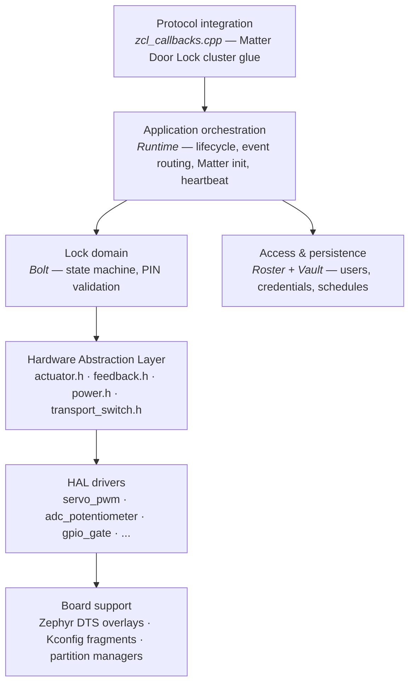

# openMatterSmartLock Architecture

This document describes the architecture of openMatterSmartLock: a hardware-independent Matter Door Lock firmware built on Zephyr, the nRF Connect SDK, and ConnectedHomeIP (Matter).

The intent is reference-quality clarity: each layer has a single responsibility, layer boundaries are explicit, and hardware dependencies are isolated behind a Hardware Abstraction Layer (HAL).

## 1. Design goals

- **Hardware independence.** No application or domain layer code may call into board-specific or driver-specific APIs directly. All hardware access flows through HAL interfaces (`actuator.h`, `feedback.h`, `power.h`, `transport_switch.h`).
- **Matter spec fidelity.** The Door Lock cluster is implemented according to the Matter specification with no manufacturer-specific deviations. The device commissions and behaves as a first-class Matter Door Lock in any ecosystem.
- **Driver selection at build time.** A single application binary configuration must build cleanly with driver selection controlled by Kconfig — adding a new actuator or feedback driver does not touch the domain layer.
- **Event-driven cross-context safety.** All cross-layer interactions are dispatched through an event queue, never via direct function calls from one execution context to another.
- **Explicit state machines.** Lock state transitions are explicitly `Initiated → Completed`; "completed" is reported only after the physical actuator confirms motion.
- **Low-power awareness.** Telemetry is consolidated into a single heartbeat task to give one coherent point for radio wake-up alignment.

## 2. Runtime stack

- **RTOS:** Zephyr
- **SDK:** nRF Connect SDK (NCS)
- **Matter stack:** ConnectedHomeIP (CHIP)
- **Build system:** CMake + west + sysbuild (application + MCUboot bootloader + related images)

Execution model:

- Application task queueing via `Nrf::PostTask(...)` and dispatch via `Nrf::DispatchNextTask()`.
- CHIP-side scheduling via `SystemLayer().ScheduleLambda(...)` for cross-thread state updates.
- Zephyr timers and delayed work (`k_timer`, `k_work_delayable`) for heartbeat, LED patterns, and telemetry.

## 3. Layered architecture

### 3.1. Layer contracts

Each layer exposes a narrow interface to the layer above and consumes only the layer directly below.

| From → To | Interface |
|---|---|
| Matter stack → Protocol integration | CHIP cluster callbacks |
| Protocol integration → Application orchestration | event dispatch (PostTask / ScheduleLambda) |
| Application orchestration → Lock domain | `Bolt` public API |
| Application orchestration → Access & persistence | `Roster` public API |
| Lock domain → HAL | `actuator.h`, `feedback.h` interfaces |
| HAL → Drivers | virtual interface dispatch |
| Drivers → Board | Zephyr device API (devicetree, GPIO, PWM, ADC) |

No layer reaches across more than one boundary. The Lock domain does not access Zephyr APIs directly; the HAL does not know about Matter; the Protocol integration does not poke registers.

## 4. Hardware Abstraction Layer

The HAL is the central design decision of openMatterSmartLock. It exists for three reasons:

1. **Testability.** The application can be built and tested headless on any host that supports Zephyr's native simulator, with mock HAL drivers replacing physical hardware.
2. **Portability.** Adding a new actuator (DC motor with H-bridge, latching solenoid, stepper) is a matter of writing a new driver against the existing `actuator.h` interface — no changes to the lock domain or Matter glue.
3. **Compile-time decoupling.** No domain-layer source file includes a driver header. HAL interfaces are pure abstract types; concrete drivers are linked in based on Kconfig.

### 4.1. `actuator.h`

Pure interface for any physical actuator capable of moving between two configured positions (locked / unlocked) and reporting motion result.

Responsibilities:

- start motion toward a target position,
- stop motion immediately,
- report whether the last motion completed successfully or stalled / timed out,
- expose configured motion parameters (angle range, direction, max actuation time).

### 4.2. `feedback.h`

Pure interface for sensing actuator or environmental state.

Responsibilities:

- sample one or more channels (battery, position, servo feedback) on demand,
- power-gate the analog front-end so the sensor draws current only during sampling windows.

### 4.3. `power.h`

Pure interface for switching auxiliary power rails (servo, sensors) under firmware control.

Responsibilities:

- gate a named rail on / off,
- query current rail state.

### 4.4. `transport_switch.h` (optional)

Pure interface for runtime transport selection (Thread ↔ Wi-Fi) on platforms that support both.

## 5. Module reference

| Module | Layer | Responsibility |
|---|---|---|
| `main.cpp` | Bootstrap | Starts `Runtime`, returns CHIP error code |
| `runtime.{cpp,h}` | Application orchestration | Matter init, event handlers, lock callback wiring, heartbeat scheduling, primary event loop |
| `lock/bolt.{cpp,h}` | Lock domain | State machine (`LockingInitiated`, `LockingCompleted`, `UnlockingInitiated`, `UnlockingCompleted`), physical operation triggering via HAL, state-change propagation |
| `access/roster.{cpp,h}` | Access and persistence | User / credential / schedule management, PIN validation against persisted state |
| `access/vault.{cpp,h}` | Access and persistence | Snapshot-based persistence backend on top of Zephyr settings / NVS |
| `matter/zcl_callbacks.cpp` | Protocol integration | Matter Door Lock cluster command and attribute handlers |
| `ui/console.{cpp,h}` | UX | LED patterns, button input, BLE commissioning UX |
| `hal/*.h` | HAL | Pure interfaces (no implementation) |
| `drivers/actuator/servo_pwm/*` | Driver | PWM servo implementation of `actuator.h` |
| `drivers/feedback/adc_potentiometer/*` | Driver | ADC potentiometer implementation of `feedback.h` |
| `drivers/power/gpio_gate/*` | Driver | GPIO-controlled power gate implementation of `power.h` |
| `transport/radio.{cpp,h}` | Optional infrastructure | Runtime Thread/Wi-Fi transport switching |

## 6. End-to-end flows

### 6.1. Local button lock / unlock

1. Console (UX) layer detects button event, posts event to `Runtime` via `PostTask`.
2. `Runtime` invokes `Bolt::Lock()` or `Bolt::Unlock()`.
3. `Bolt` transitions to `LockingInitiated` / `UnlockingInitiated`, calls actuator HAL `MoveTo(target)`.
4. Actuator driver schedules motion asynchronously; on completion, fires a callback.
5. On successful completion, `Bolt` transitions to `Completed` state and notifies `Runtime`.
6. `Runtime` schedules a Matter attribute update via `SystemLayer().ScheduleLambda`, which writes the new state into the Door Lock cluster and triggers a Matter report.
7. On failed motion, `Bolt` surfaces a stall / timeout event instead of advancing the state.

### 6.2. Remote Matter lock / unlock

1. Matter controller (e.g., Apple Home) invokes `LockDoor` / `UnlockDoor` command.
2. Matter stack dispatches to ZCL handler in `zcl_callbacks.cpp`.
3. If `RequirePINforRemoteOperation` is set, `Roster::ValidatePin` is called.
4. On success, the flow joins step 3 of the local flow above.

### 6.3. Boot and initialization

1. `main` starts `Runtime::StartApp`.
2. `Runtime` initializes the Console UX layer, registers Matter event handlers, wires lock callbacks.
3. Matter server initialization: `PrepareServer`, `StartServer`.
4. `Vault` loads persisted users / credentials / schedules into the in-memory `Roster`.
5. Actuator driver initializes hardware (PWM, GPIO, ADC) via Zephyr devicetree bindings.
6. Heartbeat timer starts (default: every 5 s — uptime, battery sample, servo state).
7. Main event loop: `while (true) { Nrf::DispatchNextTask(); }`.

## 7. Persistence model

- Users, credentials, and schedules live in RAM during runtime, owned by `Roster`.
- Persistence is **snapshot-based** via `Vault`: writes occur on explicit save points (commissioning, factory reset, credential add / remove), not write-through on every state change.
- Trade-off: predictable flash wear and simple consistency model, at the cost of a small window of data loss on uncontrolled reset.
- Storage backend: Zephyr settings / NVS, accessed only via `Vault`.

## 8. Configuration and build variants

### 8.1. Project profiles

- `prj.conf` — debug build, full logging.
- `prj_release.conf` — release build, logging stripped, aggressive size optimization.
- `prj_release_ota.conf` — release + MCUboot + Matter OTA Requestor, internal-flash slots.
- `prj_radioed.conf` — Thread + Wi-Fi multi-transport variant for SoCs that carry both radios.

### 8.2. Key Kconfig surfaces

- HAL driver selection (`CONFIG_OMSL_ACTUATOR_SERVO_PWM`, etc.)
- Board support (`CONFIG_BOARD_*` from Zephyr)
- Matter / CHIP integration options (commissioning, factory data, OTA)
- Power management policies (sleep, heartbeat interval, telemetry gating)
- BLE / NUS optional command surface

### 8.3. Sysbuild role

Sysbuild composes the application image with MCUboot and any auxiliary images (network core firmware on multi-core SoCs, MCU configuration). All board-specific image partitioning is described in `pm_static_<board>.yml`.

## 9. Hardware and devicetree architecture

openMatterSmartLock relies on Zephyr's devicetree to describe board-specific hardware. The application code refers to abstract devicetree nodes (`servo_pwm`, `feedback_adc`, `power_gate`), and each board overlay binds those nodes to concrete pins / peripherals.

Custom devicetree bindings (e.g., for the servo actuator binding) live in `firmware/dts/bindings/`.

## 10. Power and reliability characteristics

- Heartbeat-driven telemetry consolidates all periodic sampling into a single 5-second task, simplifying radio wake-up alignment.
- Actuator and feedback drivers are expected to power-gate their hardware between operations (servo rail off when idle, ADC front-end powered only during sampling).
- Lock state transitions are explicitly two-phase (`Initiated → Completed`), preventing the device from reporting a state it has not physically achieved.
- Failed motion (stall, timeout, sensor mismatch) is surfaced as an event, not silently treated as success.

## 11. Extension points

- **New actuator** → add a driver under `firmware/drivers/actuator/<name>/`, implement `actuator.h`, expose via Kconfig.
- **New feedback sensor** → same pattern under `firmware/drivers/feedback/<name>/`.
- **New board** → add `firmware/boards/<board>.overlay` and `<board>.conf`, plus `pm_static_<board>.yml` if partitioning is needed. See [the porting guide](../guides/porting.md).
- **New companion app** → openMatterSmartLock does not ship a companion app of its own; commissioning works in any standard Matter commissioner. Downstream products that want a branded or feature-specific companion app are expected to host it in a separate repository.

## 12. Memory model (summary)

See [the memory model document](memory-model.md) for the full document. The condensed rules:

- Static allocation by default; module singletons in `.bss`.
- No heap from domain code. Heap is reserved for Matter / BLE / Thread stacks.
- Per-thread stacks sized against measured high-water marks, not guessed.
- No C++ exceptions, no RTTI.
- Snapshot-based persistence; access records live in RAM and flush on explicit save points.

## 13. Key architectural decisions (ADR-style summary)

### ADR-1 — Event-driven orchestration over synchronous call chain

All cross-layer interactions are dispatched through the event queue (`Nrf::PostTask`, `SystemLayer().ScheduleLambda`), never via direct function call from one execution context to another. This eliminates a class of race conditions between the Matter stack thread and the application task, and gives a single coherent place to add tracing or instrumentation.

### ADR-2 — In-memory access model with persisted snapshots

Users, credentials, and schedules live in RAM at runtime; persistence is snapshot-based, not write-through transactional. The trade-off favors runtime simplicity and predictable flash wear over per-mutation durability.

### ADR-3 — HAL boundary, no compile-time hardware coupling

Domain-layer code (lock state machine, access manager) never includes a driver header. All hardware access flows through pure HAL interfaces (`hal/*.h`). Drivers are selected at Kconfig / link time. This enables headless / native_sim builds, CI without hardware, and trivial actuator swap.

### ADR-4 — Heartbeat-centric telemetry

All low-frequency periodic sampling (battery, servo state, system health) is consolidated into a single 5-second heartbeat task rather than spread across independent timers. Gives one coherent point to coordinate with radio wake-ups for low-power operation.

### ADR-5 — Explicit two-phase lock state machine

Lock operations are modeled as `Initiated → Completed` rather than as immediate state changes. The `Completed` state is reported only after the actuator HAL confirms successful motion. Failed motion surfaces as a separate event. This eliminates the "device claims locked but isn't" failure mode.

### ADR-6 — Standard Matter Door Lock cluster, no manufacturer-specific deviations

The protocol surface is pure Matter Door Lock. The device commissions and behaves as a first-class Matter Door Lock in any ecosystem. No manufacturer-specific clusters are required for basic operation. Implementations that need product-specific configuration are expected to layer those on top in a downstream repository, not in openMatterSmartLock itself.

### ADR-7 — Static-allocation policy for domain layer

Domain-layer code (lock state machine, access manager, drivers) must not call into dynamic allocators. All such modules are constructed once, in static storage, with first-use initialization. The Matter stack is permitted to use the heap pool; the application is not. Rationale: deterministic memory footprint, no allocation failures in the lock-control path, no fragmentation across multi-year operation.
