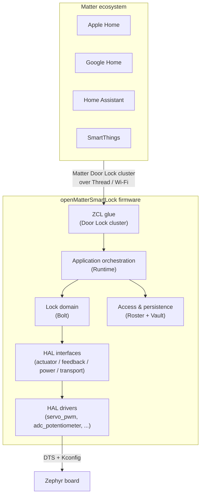

  

# openMatterSmartLock

> **An open, hardware-independent Matter Door Lock reference implementation.**
> Built on Zephyr, the nRF Connect SDK, and the ConnectedHomeIP (Matter) stack.

openMatterSmartLock is a complete Matter Door Lock firmware that commissions and behaves as a first-class Matter Door Lock in any ecosystem (Apple Home, Google Home, Home Assistant, SmartThings). It is designed from day one with a clean layered architecture and explicit hardware abstraction interfaces, so the same firmware can drive servos, DC motors, solenoids, or stepper actuators without changes in the domain layer.

## At a glance

## Where to start

-   :material-rocket-launch: **[Getting Started](guides/getting-started.md)**

    Build openMatterSmartLock on the reference nanoBoard hardware in five steps.

-   :material-sitemap: **[Architecture Overview](architecture/overview.md)**

    Layered design, contracts between layers, and the seven core architectural decisions.

-   :material-chip: **[Porting Guide](guides/porting.md)**

    Add a new board, a new actuator driver, or a new feedback sensor.

-   :material-shield-lock: **[Security Model](guides/security-model.md)**

    Threat model, trust boundaries, and the protections that ship in v0.1.

## Project status

| Aspect | State |
| --- | --- |
| Reference build profile | nanoBoard (nRF52840), debug + release + release+OTA |
| Test infrastructure | Host-side unit tests for `Bolt` and `Roster` (CI) |
| Documentation | Built per-commit, published to GitHub Pages |
| Compliance | Not certified — reference quality only |

See the [latest CI status badges](https://github.com/jakub-michalik/open-smart-lock) on the repository home page.
