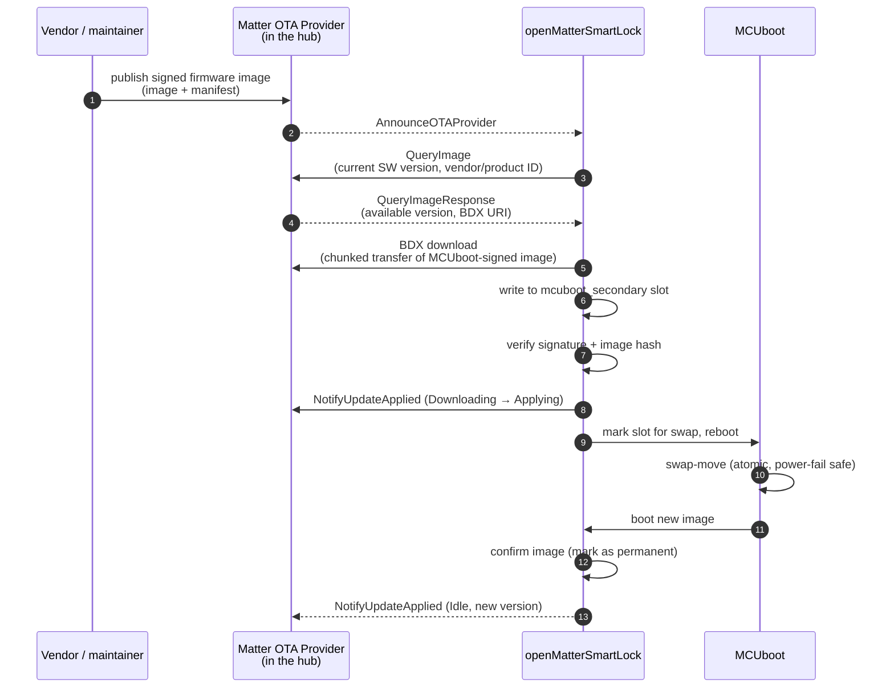

# OTA Updates

openMatterSmartLock supports field firmware update via the standard **Matter OTA Software Update cluster**, with no manufacturer-specific extensions. Update images are delivered through any Matter OTA Provider — typically the user's hub (Apple Home Hub, Google Hub, Home Assistant with `python-matter-server`, SmartThings hub) — and applied at next reboot via MCUboot's swap-move algorithm.

The OTA path is only available in the **release+OTA** build profile.

## End-to-end flow



## What the firmware does

The release+OTA build enables:

```text
CONFIG_CHIP_OTA_REQUESTOR=y                     # Matter OTA Requestor cluster
CONFIG_CHIP_OTA_REQUESTOR_REBOOT_ON_APPLY=y     # auto-reboot once image is staged
CONFIG_CHIP_BOOTLOADER_MCUBOOT=y                # use MCUboot as the second-stage loader
CONFIG_BOOTLOADER_MCUBOOT=y                     # build MCUboot as a sysbuild image
```

Behavior is then driven by the Matter stack — application code does not need to handle the download, swap, or rollback flow.

## What MCUboot does

MCUboot operates the two image slots defined in [the partition layout](../reference/partitions.md):

1. **Primary slot** holds the currently-running, *confirmed* image.
2. **Secondary slot** holds the incoming candidate after a successful download.

On reboot, MCUboot:

1. checks the secondary slot's trailer for the "pending upgrade" flag;
2. validates the image signature against the public key compiled into the bootloader;
3. verifies the image hash;
4. swaps primary ↔ secondary using swap-move (atomic — power loss at any step rolls back cleanly);
5. boots the new image;
6. if the new image marks itself as confirmed (`boot_write_img_confirmed`), the upgrade becomes permanent. If not, MCUboot will roll back on the next reboot — protection against bricked field devices.

openMatterSmartLock confirms the new image automatically inside the Matter OTA Requestor's `MarkImageConfirmed()` hook, once the Matter stack reports a successful commission to a fabric on the new firmware. This is the standard NCS pattern.

## Image format

The image written to the secondary slot is an MCUboot-signed binary:

```text
┌────────────────────┐
│ MCUboot header     │  image type, version, flags
├────────────────────┤
│ application binary │
├────────────────────┤
│ TLVs               │  hash, signature
└────────────────────┘
```

The signing key is `mcuboot/root-ec-p256.pem` in the MCUboot tree by default. Production deployments must replace this with a project-controlled key — the build system reads `CONFIG_BOOT_SIGNATURE_KEY_FILE` to locate the PEM.

## Operational considerations

| Topic | Notes |
| --- | --- |
| **Image size budget** | Primary slot is 484 KiB. Current release+OTA build fills ~99 %. Adding features requires removing existing features or moving to a larger-flash SoC. |
| **Power loss** | Swap-move is atomic — a power loss mid-swap rolls back to the old image. No bricking risk. |
| **Rollback** | If the new image fails to confirm (Matter never re-commissions), MCUboot reverts to the previous image on the next reboot. |
| **Battery cost** | Download + swap = ~1 mAh on a CR123 stack. Schedule updates while mains-powered if possible (e.g. door-charged variants). |
| **Network** | The Matter OTA flow runs over the device's normal Matter transport (Thread or Wi-Fi). No separate channel needed. |

## Verifying the update

After an update, you can verify the new version through any Matter commissioner:

- **Apple Home**: Settings → Accessories → openMatterSmartLock → Software Version
- **Home Assistant**: Developer Tools → States → `lock.<name>` attribute `sw_version`
- **`chip-tool`**: `chip-tool basicinformation read software-version <node-id> 0`

## Related

- [Build Profiles](../reference/build-profiles.md) — how to build the release+OTA image
- [Partition Layout](../reference/partitions.md) — flash map under MCUboot
- [Security Model](../guides/security-model.md) — trust boundaries during the OTA flow
