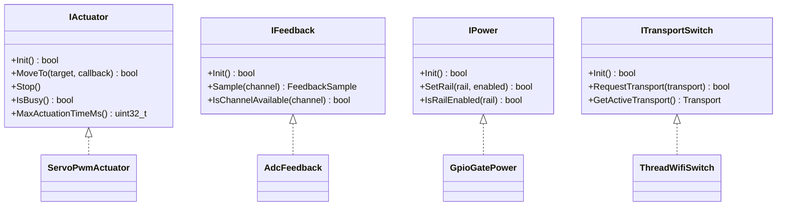

# HAL Interface Reference

The Hardware Abstraction Layer (HAL) is the contract between the openMatterSmartLock domain layer and physical hardware. Domain code (Bolt, Roster, Vault, Console, Radio, Runtime) is forbidden from including any driver header directly. All hardware access flows through the four interfaces documented here.

This page is the canonical reference for the public surface of each interface. Concrete drivers live under `firmware/drivers/<category>/<name>/` and are selected at build time via Kconfig.

## `IActuator` — actuator HAL

**Header:** `firmware/app/hal/actuator.h`

Any physical actuator capable of driving the lock bolt between two configured positions. The interface is intentionally asynchronous: `MoveTo()` schedules motion and invokes the completion callback exactly once, regardless of outcome.

### Types

| Symbol | Meaning |
| --- | --- |
| `ActuatorTarget::Locked` | move toward the locked position |
| `ActuatorTarget::Unlocked` | move toward the unlocked position |
| `ActuatorResult::Success` | motion completed within `MaxActuationTimeMs()` |
| `ActuatorResult::Stalled` | mechanical resistance detected (driver-defined) |
| `ActuatorResult::TimedOut` | motion did not complete in budget |
| `ActuatorResult::AbortedByCaller` | `Stop()` was called mid-motion |
| `ActuatorResult::Unsupported` | requested target not valid for this driver |

### Methods

| Method | Contract |
| --- | --- |
| `bool Init()` | One-shot initialization, called from `Runtime::StartApp()` before any motion. Returns `false` on hardware failure. |
| `bool MoveTo(target, cb)` | Starts asynchronous motion. `cb` is invoked exactly once. Returns `false` immediately if the driver cannot accept the request. |
| `void Stop()` | Aborts in-flight motion. The completion callback fires with `AbortedByCaller`. |
| `bool IsBusy() const` | True if a motion is currently in progress. |
| `uint32_t MaxActuationTimeMs() const` | Worst-case time budget. Used by `Bolt` for state-machine watchdog. |

### Reference driver

[`servo_pwm`](https://github.com/jakub-michalik/open-smart-lock/tree/main/firmware/drivers/actuator/servo_pwm) — SG90-class servo over Zephyr PWM, configured via the `omsl,actuator-servo-pwm` devicetree binding.

## `IFeedback` — feedback HAL

**Header:** `firmware/app/hal/feedback.h`

Synchronous sampling of analog state (battery, position). Implementations are expected to power-gate the analog front-end through `IPower` so quiescent current stays at zero.

### Channels

| Channel | Units | Typical source |
| --- | --- | --- |
| `BatteryVoltage` | mV (after divider) | ADC on `vbatt_div` node |
| `ActuatorPosition` | mV from servo feedback line | ADC on servo PWM/feedback pin |

### Methods

| Method | Contract |
| --- | --- |
| `bool Init()` | Brings up the ADC and references. |
| `FeedbackSample Sample(channel)` | Blocking sample. `valid=false` if the channel is not configured. |
| `bool IsChannelAvailable(channel) const` | Compile-time / DTS-time availability for this board. |

## `IPower` — power rail HAL

**Header:** `firmware/app/hal/power.h`

Per-rail control of auxiliary power. The rationale is that on a battery-powered SED the actuator and analog front-end must be fully de-energized between operations — the MCU drives a high-side or low-side switch via GPIO and only enables a rail for the duration of an operation.

### Rails

| Rail | Typical load |
| --- | --- |
| `Actuator` | Servo / motor / solenoid power |
| `Feedback` | ADC reference divider, sensor bias |

### Methods

| Method | Contract |
| --- | --- |
| `bool Init()` | Configures GPIOs in the safe (off) state. |
| `bool SetRail(rail, enabled)` | Returns `false` if the rail is not configured on this board. |
| `bool IsRailEnabled(rail) const` | Read current state. |

## `ITransportSwitch` — optional transport HAL

**Header:** `firmware/app/hal/transport_switch.h`

Optional. Only present on SoCs that carry both Thread (802.15.4) and Wi-Fi radios (e.g. nRF5340 + nRF7002 combinations). The default reference target (nanoBoard / nRF52840) does not provide this interface.

### Methods

| Method | Contract |
| --- | --- |
| `bool Init()` | Brings up both transport stacks in a parked state. |
| `bool RequestTransport(transport)` | Asynchronous request — switch may be deferred until safe (e.g. after current Matter operation completes). |
| `Transport GetActiveTransport() const` | Currently selected transport. |

## Adding a new driver

The full procedure is documented in [the porting guide](../guides/porting.md). At a high level:

1. Pick the right interface (`IActuator`, `IFeedback`, or `IPower`).
2. Create `firmware/drivers/<category>/<name>/` and implement the interface.
3. Add a Kconfig option that selects the new driver.
4. Wire the driver into `Runtime::StartApp()` behind that Kconfig option.
5. If hardware-specific, expose configuration through a devicetree binding under `firmware/dts/bindings/`.

The domain layer never changes.
